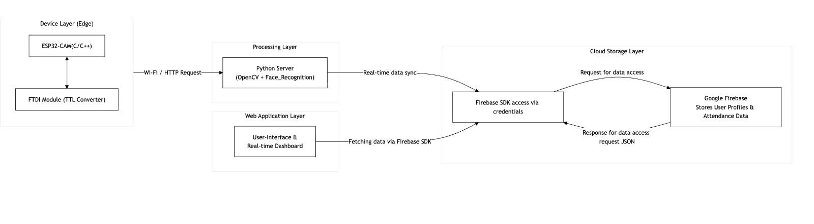

# ⚙️ AI-Driven Real-Time Attendance Monitoring System  

> **An intelligent, automated attendance solution integrating AI, IoT,  Django, and cloud technologies for real-time monitoring and highly accurate attendance tracking.**  

---

## 🎯 Objectives  

- Automate attendance using **AI-based facial recognition** with a **FastAPI-powered backend**.  
- Integrate **ESP32-CAM IoT device** for real-time face capture.  
- **Eliminate manual entry** and prevent **proxy or duplicate attendance** through daily validation logic.  
- Enable **real-time attendance tracking** and cloud synchronization with Firebase Firestore.  
- Provide a **Django-based admin dashboard** for viewing attendance, students, and real-time status.  
- Achieve a modular architecture with **IoT → FastAPI → Firebase → Django** for scalability and maintainability.  

---

## System Architecture  

---

## Tech Stack  

| Category | Tools / Frameworks |
|-----------|--------------------|
| **IoT Device** | ESP32-CAM + FTDI Programmer |
| **AI / ML Library** | `face_recognition` (dlib – ResNet 128D Embeddings) |
| **Backend Engine** | **FastAPI** (Face Recognition Server) |
| **Admin Interface** | **Django** (MVT Architecture) |
| **Cloud Database** | Firebase Firestore |
| **Cloud Storage** | Firebase Storage |
| **Languages** | Python, HTML, CSS |
| **Communication** | HTTP Requests (ESP32 → FastAPI), REST APIs |

---

## Key Features  

- 🔹 **FastAPI-Based Facial Recognition:**  
  Processes images from the ESP32, performs encoding, and matches faces using deep learning.

- 🔹 **IoT Integration with ESP32-CAM:**  
  Captures and streams live images to the AI engine for recognition.

- 🔹 **Firebase Cloud Sync:**  
  Real-time storage of attendance records and instant reflection on Django dashboard.

- 🔹 **Optimized Recognition Pipeline:**  
  Resizing, caching, and model preprocessing ensure fast responses (300–500ms).

- 🔹 **Duplicate Attendance Prevention:**  
  Ensures **one attendance per student per day** using Firestore queries.

- 🔹 **Django Admin Dashboard:**  
  A clean web interface to visualize daily attendance, student profiles, and timestamps.

- 🔹 **Event-Driven Camera Activation:**  
  Helps prevent ESP32 heating issues and reduces unnecessary processing.

---

## 🚀 Results & Impact  

- ⚡ **Recognition Speed:** 0.1 – 1 second per frame (end-to-end pipeline)  
- 🎯 **Accuracy:** Stable and reliable under varying lighting conditions  
- ☁️ **Cloud Sync:** Attendance updates appear instantly in the Django interface  
- 🧱 **Architecture Quality:** Clear modular separation makes future upgrades easier  

---

## ⚠️ Usage Restrictions  

This repository is **not open-source**.  
It is intended **for demonstration and academic reference only**.  

- ❌ Do **not fork**, **clone**, or **redistribute** this repository.  
- ❌ Strictly no reuse of code or architecture without permission.  

📬 For permissions or collaboration:  
📧 **prabhalasaisirisha25@gmail.com**

📄 Read **[LICENSE.txt](./LICENSE.txt)** for complete terms.  

---

⭐ **Developed by [Sai Sirisha Devi Prabhala](mailto:saisirishaprabhala25@gmail.com)**  
> _Making attendance systems smarter, faster, and fully automated with AI + IoT + Cloud (Firebase) + FastAPI + Django._
